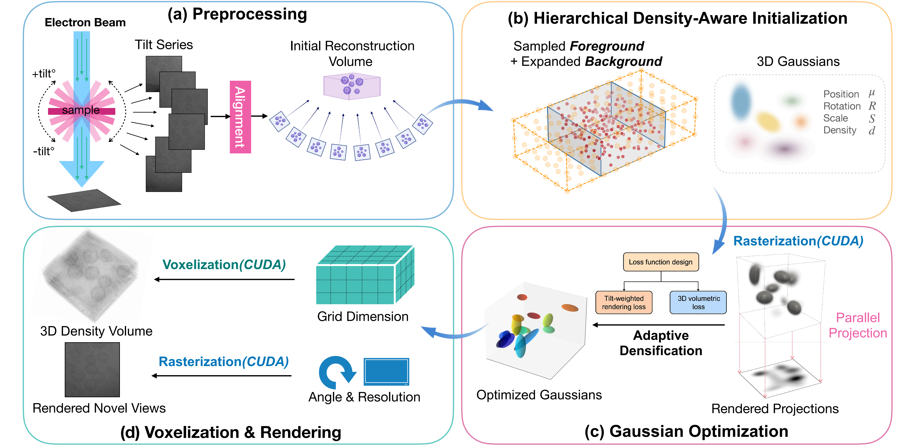

# CryoETGS [JSB 2025]

> [**Adaptive Gaussian representation for differentiable cryo-electron tomography reconstruction**](https://doi.org/10.1016/j.jsb.2025.108281)           
> [[Project Page]](https://github.com/JachyLikeCoding/ETGS)           
> Journal of Structural Biology (108281)          
> Chi Zhang          

We present CryoETGS, a differentiable learning framework that **reconstruct**s tomograms through adaptive 3D Gaussian representations of biological structures for **cryo-ET**.



📖 Abstract
----------------
Cryo-electron tomography (cryo-ET) enables 3D visualization of biological structures in their native state, but high-fidelity tomogram reconstruction remains challenging 
due to low signal-to-noise ratios and limited angular sampling. In this work, we present CryoETGS, a differentiable learning framework that reconstructs tomograms through 
adaptive 3D Gaussian representations of biological structures for cryo-ET. This representation enables efficient and interpretable reconstructions through a 
hardware-accelerated differentiable rendering pipeline aligned with the cryo-ET imaging geometry. CryoETGS incorporates hierarchical initialization, adaptive densification, 
and a tilt-weighted optimization strategy to enhance convergence and reconstruction fidelity. The framework further supports real-time projection synthesis and 
bidirectional conversion between voxel and Gaussian representations. Extensive experiments on both simulated and experimental datasets demonstrate that CryoETGS 
achieves state-of-the-art reconstruction results, effectively mitigates missing wedge artifacts, and exhibits high computational efficiency. 

🆕 Updates
-----------------
:fire: 2025/12/17: The paper is accepted by the Journal of Structural Biology and is online now. More sources will be released as soon as possible.

2025/01/06: We released the basic project code.


🔖 Usage
-----------------
## Installation
```
# Clone the repository
git clone https://github.com/JachyLikeCoding/ETGS.git
cd CryoETGS

# Create environment
conda create -n etgs python=3.10
conda activate etgs

# Install dependencies
pip install -r requirements.txt

# Compile the CUDA rasterizer
pip install ./cryoETGS/submodules/simple-knn
pip install ./cryoETGS/submodules/diff-gaussian-rasterization_voxelization_cryoet
```

## Data preparation
Organize your cryo-ET dataset in ``/data`` as follows:
```
<EMPIAR-XXXXX>
├── images/          # Tilt series (.mrc)
├── sparse/          # Ground truth tomogram (.mrc, reconstructed by WBP/SIRT/other methods)
└── tilt.rawtlt (tilt.aln)  # Tilt angle (.tlt/.rawtlt/.aln)
```


## Training
To start the reconstruction process with default hyperparameters:
```
python train.py --config_name xxx

```


✏️ Citation
---------------
If you find CryoETGS useful in your research or refer to the provided baseline results, please star :star: this repository and consider citing :pencil::
```
@article{zhang2025adaptive,
  title={Adaptive Gaussian representation for differentiable cryo-electron tomography reconstruction},
  author={Zhang, Chi and Yang, Zhidong and Han, Renmin and Zhang, Fa and Feng, Jieqing},
  journal={Journal of Structural Biology},
  pages={108281},
  year={2025},
  publisher={Elsevier}
}
```

Contact
---------------
For questions, please contact 1098587201@qq.com. Because I can't access GitHub at any time right now.
